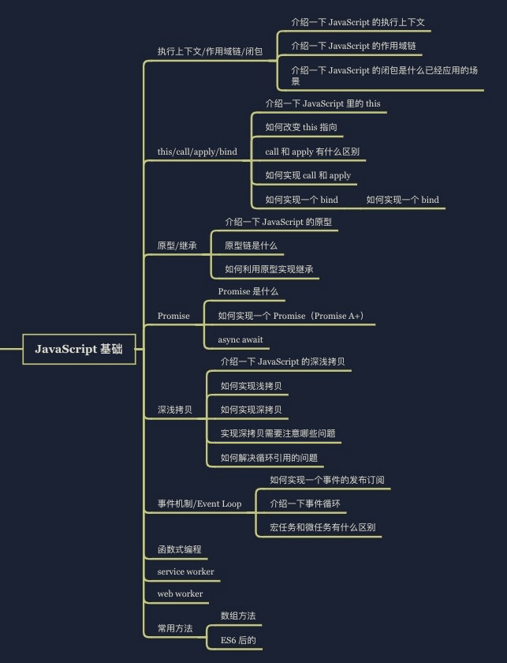
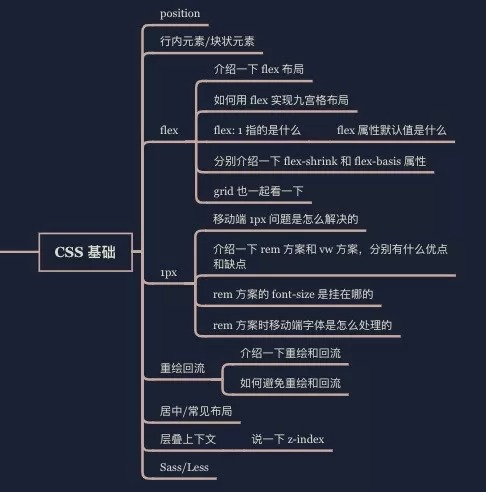
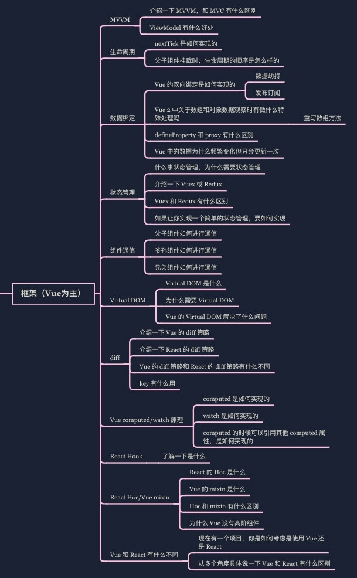
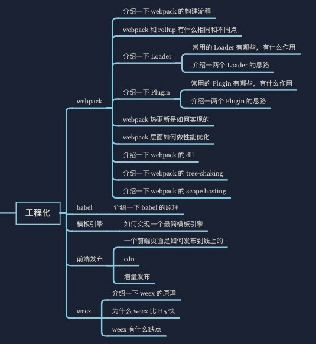
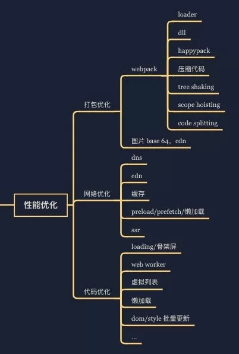
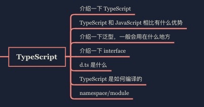
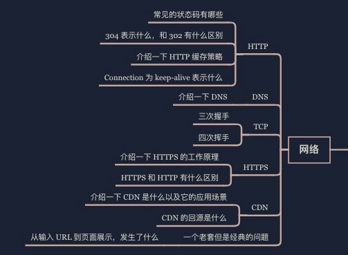
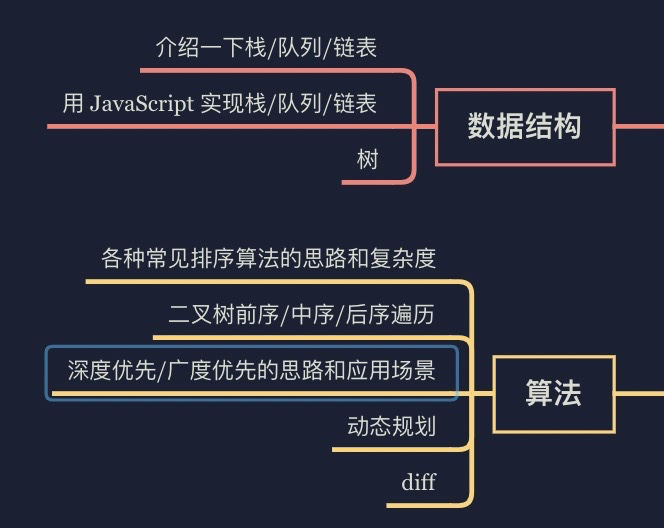
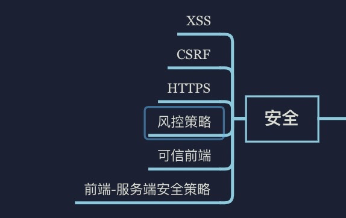

# 复习

## 1. JavaScript 基础





### 1.1 执行上下文 / 作用域链 / 闭包 

- [理解 JavaScript 中的执行上下文和执行栈 ](https://juejin.im/post/5ba32171f265da0ab719a6d7)
- [JavaScript 深入之执行上下文栈 ](https://github.com/mqyqingfeng/Blog/issues/4)
- [一道 js 面试题引发的思考 ](https://github.com/kuitos/kuitos.github.io/issues/18)
- [JavaScript 深入之词法作用域和动态作用域 ](https://github.com/mqyqingfeng/Blog/issues/3)
- [JavaScript 深入之作用域链 ](https://github.com/mqyqingfeng/Blog/issues/6)
- [发现 JavaScript 中闭包的强大威力 ](https://juejin.im/post/5c4e6a90e51d4552266576d2)
- [JavaScript 闭包的底层运行机制 ](http://blog.leapoahead.com/2015/09/15/js-closure/)
- [我从来不理解 JavaScript 闭包，直到有人这样向我解释它...](https://zhuanlan.zhihu.com/p/56490498)
- [破解前端面试（80% 应聘者不及格系列）：从闭包说起 ](https://juejin.im/post/58f1fa6a44d904006cf25d22#heading-0)

### 1.2 this/call/apply/bind

- [JavaScript 基础心法——this](https://github.com/axuebin/articles/issues/6)
- [JavaScript 深入之从 ECMAScript 规范解读 this](https://github.com/mqyqingfeng/Blog/issues/7)
- [前端基础进阶（七）：全方位解读 this](https://www.jianshu.com/p/d647aa6d1ae6)
- [面试官问：JS 的 this 指向 ](https://juejin.im/post/5c0c87b35188252e8966c78a)
- [JavaScript 深入之 call 和 apply 的模拟实现 ](https://juejin.im/post/5907eb99570c3500582ca23c)
- [JavaScript 基础心法—— call apply bind](https://github.com/axuebin/articles/issues/7)
- [面试官问：能否模拟实现 JS 的 call 和 apply 方法 ](https://juejin.im/post/5bf6c79bf265da6142738b29)
- [回味 JS 基础: call apply 与 bind](https://juejin.im/post/57dc97f35bbb50005e5b39bd)
- [面试官问：能否模拟实现 JS 的 bind 方法 ](https://juejin.im/post/5bec4183f265da616b1044d7)
- [不用 call 和 apply 方法模拟实现 ES5 的 bind 方法 ](https://github.com/jawil/blog/issues/16)

### 1.3 原型 / 继承

- [👉深入理解 JavaScript 原型](https://mp.weixin.qq.com/s?__biz=MzA4Njc2MTE3Ng==&mid=2456151505&idx=1&sn=07de1105b4779510444703d3cca52336&scene=21#wechat_redirect)
- [【THE LAST TIME】一文吃透所有 JS 原型相关知识点 ](https://juejin.im/post/5dba456d518825721048bce9)
- [重新认识构造函数、原型和原型链 ](https://juejin.im/post/5c6a9c10f265da2db87b98f3)
- [JavaScript 深入之从原型到原型链 ](https://github.com/mqyqingfeng/blog/issues/2)
- [最详尽的 JS 原型与原型链终极详解，没有「可能是」。（一）](https://www.jianshu.com/p/dee9f8b14771)
- [最详尽的 JS 原型与原型链终极详解，没有「可能是」。（二）](https://www.jianshu.com/p/652991a67186)
- [最详尽的 JS 原型与原型链终极详解，没有「可能是」。（三）](https://www.jianshu.com/p/a4e1e7b6f4f8)
- [JavaScript 引擎基础：原型优化 ](https://hijiangtao.github.io/2018/08/21/Prototypes/)
- [Prototypes in JavaScript](https://medium.com/better-programming/prototypes-in-javascript-5bba2990e04b)
- [JavaScript 深入之创建对象的多种方式以及优缺点 ](https://github.com/mqyqingfeng/Blog/issues/15)
- [详解 JS 原型链与继承 ](http://louiszhai.github.io/2015/12/15/prototypeChain/)
- [从__proto__和 prototype 来深入理解 JS 对象和原型链 ](https://github.com/creeperyang/blog/issues/9)
- [代码复用模式 ](https://github.com/jayli/javascript-patterns/blob/master/chapter6.markdown)
- [JavaScript 中的继承：ES3、ES5 和 ES6](http://tianfangye.com/2017/12/31/inheritance-in-javascript-es3-es5-and-es6/)

### 1.4 Promise

- [👉100 行代码实现 Promises/A+ 规范](https://mp.weixin.qq.com/s?__biz=MzA4Njc2MTE3Ng==&mid=2456151398&idx=1&sn=c3351d6c9eb166035f2fa97a1b0b3a0a&scene=21#wechat_redirect)
- [你好，JavaScript 异步编程 ---- 理解 JavaScript 异步的美妙 ](https://juejin.im/post/5b56c3586fb9a04faa79a8e0)
- [Promise 不会？？看这里！！！史上最通俗易懂的 Promise！！！](https://juejin.im/post/5afe6d3bf265da0b9e654c4b)
- [一起学习造轮子（一）：从零开始写一个符合 Promises/A + 规范的 promise](https://juejin.im/post/5b16800fe51d4506ae719bae#heading-34)
- [Promise 实现原理（附源码）](https://juejin.im/post/5b83cb5ae51d4538cc3ec354)
- [当 async/await 遇上 forEach](https://objcer.com/2017/10/12/async-await-with-forEach/)
- [Promise 必知必会（十道题）](https://juejin.im/post/5a04066351882517c416715d)
- [BAT 前端经典面试问题：史上最最最详细的手写 Promise 教程 ](https://juejin.im/post/5b2f02cd5188252b937548ab#heading-9)

```
async function async1() {
  console.log('async1 start');
  await async2();
  console.log('async1 end');
}

// 相当于
async function async1() {
  console.log('async1 start');
  Promise.resolve(async2()).then(() => {
    console.log('async1 end');
  })
}
```

### 1.5 深浅拷贝

- [JavaScript 基础心法——深浅拷贝 ](https://github.com/axuebin/articles/issues/20)
- [深拷贝的终极探索（90% 的人都不知道）](https://juejin.im/post/5bc1ae9be51d450e8b140b0c)
- [JavaScript 专题之深浅拷贝 ](https://github.com/mqyqingfeng/Blog/issues/32)
- [javaScript 中浅拷贝和深拷贝的实现 ](https://github.com/wengjq/Blog/issues/3)
- [深入剖析 JavaScript 的深复制 ](https://jerryzou.com/posts/dive-into-deep-clone-in-javascript/)
- [「JavaScript」带你彻底搞清楚深拷贝、浅拷贝和循环引用 ](https://segmentfault.com/a/1190000015042902)
- [面试题之如何实现一个深拷贝 ](https://github.com/yygmind/blog/issues/29)

### 1.6 事件机制 / Event Loop

- [Tasks, microtasks, queues and schedules](https://jakearchibald.com/2015/tasks-microtasks-queues-and-schedules/)
- [How JavaScript works](https://blog.sessionstack.com/how-javascript-works-event-loop-and-the-rise-of-async-programming-5-ways-to-better-coding-with-2f077c4438b5)
- [从 event loop 规范探究 javaScript 异步及浏览器更新渲染时机 ](https://github.com/aooy/blog/issues/5)
- [这一次，彻底弄懂 JavaScript 执行机制 ](https://juejin.im/post/59e85eebf265da430d571f89)
- [【THE LAST TIME】彻底吃透 JavaScript 执行机制 ](https://juejin.im/post/5d901418518825539312f587)
- [一次弄懂 Event Loop（彻底解决此类面试问题）](https://juejin.im/post/5c3d8956e51d4511dc72c200)
- 
- [浏览器与 Node 的事件循环 (Event Loop) 有何区别?](https://zhuanlan.zhihu.com/p/54882306)
- [深入理解 JavaScript Event Loop](https://zhuanlan.zhihu.com/p/34229323)
- [The Node.js Event Loop, Timers, and process.nextTick()](https://nodejs.org/en/docs/guides/event-loop-timers-and-nexttick/)

这个知识点真的是重在理解，一定要理解彻底

```
for (macroTask of macroTaskQueue) {
  handleMacroTask();
  
  for (microTask of microTaskQueue) {
    handleMicroTask(microTask);
  }
}
```

### 1.7 函数式编程

- [函数式编程指北 ](https://llh911001.gitbooks.io/mostly-adequate-guide-chinese/content/)
- [JavaScript 专题之函数柯里化 ](https://github.com/mqyqingfeng/Blog/issues/42)
- [Understanding Functional Programming in Javascript](https://levelup.gitconnected.com/understanding-functional-programming-in-javascript-a-complete-guide-e85ed13b42c8)
- [What is Functional Programming?](https://medium.com/javascript-scene/master-the-javascript-interview-what-is-functional-programming-7f218c68b3a0)
- [简明 JavaScript 函数式编程——入门篇 ](https://juejin.im/post/5d70e25de51d453c11684cc4)
- [You Should Learn Functional Programming](https://dev.to/allanmacgregor/you-should-learn-functional-programming-in-2018-4nff)
- [JavaScript 函数式编程到底是个啥 ](https://segmentfault.com/a/1190000009864459)
- [JavaScript - 函数式编程 ](https://github.com/ecmadao/Coding-Guide/blob/master/Notes/JavaScript/JavaScript%E5%87%BD%E6%95%B0%E5%BC%8F%E7%BC%96%E7%A8%8B.md)

### 1.8 Service Worker / PWA

- [Service Worker：简介 ](https://developers.google.com/web/fundamentals/primers/service-workers)
- [JavaScript 是如何工作的：Service Worker 的生命周期及使用场景 ](https://github.com/qq449245884/xiaozhi/issues/8)
- [借助 Service Worker 和 cacheStorage 缓存及离线开发 ](https://www.zhangxinxu.com/wordpress/2017/07/service-worker-cachestorage-offline-develop/)
- [PWA Lavas 文档 ](https://lavas.baidu.com/pwa/README)
- [PWA 学习手册 ](https://pwa.alienzhou.com/)
- [面试官：请你实现一个 PWA](https://juejin.im/post/5e26aa785188254c257c462d#heading-24)

### 1.9 Web Worker

- [浅谈 HTML5 Web Worker](https://juejin.im/post/59c1b3645188250ea1502e46)
- [JavaScript 中的多线程 -- Web Worker](https://zhuanlan.zhihu.com/p/25184390)
- [JavaScript 性能利器 —— Web Worker](https://juejin.im/post/5c10e5a9f265da611c26d634)
- [A Simple Introduction to Web Workers in JavaScript](https://medium.com/young-coder/a-simple-introduction-to-web-workers-in-javascript-b3504f9d9d1c)
- [Speedy Introduction to Web Workers](https://auth0.com/blog/speedy-introduction-to-web-workers/)

### 1.10 常用方法

太多了... 总的来说就是 API 一定要熟悉...

- [近一万字的 ES6 语法知识点补充 ](https://juejin.im/post/5c6234f16fb9a049a81fcca5)
- [ES6、ES7、ES8 特性一锅炖 (ES6、ES7、ES8 学习指南)](https://juejin.im/post/5b9cb3336fb9a05d290ee47e)
- [解锁多种 JavaScript 数组去重姿势 ](https://juejin.im/post/5b0284ac51882542ad774c45)
- [Here’s how you can make better use of JavaScript arrays](https://www.freecodecamp.org/news/heres-how-you-can-make-better-use-of-javascript-arrays-3efd6395af3c/)
- [一个合格的中级前端工程师需要掌握的 28 个 JavaScript 技巧 ](https://juejin.im/post/5cef46226fb9a07eaf2b7516)
- [1.5 万字概括 ES6 全部特性 (已更新 ES2020)](https://juejin.im/post/5d9bf530518825427b27639d)

## 2. CSS 基础





- [position - CSS: Cascading Style Sheets | MDN](https://developer.mozilla.org/en-US/docs/Web/CSS/position)
- [position | CSS Tricks](https://css-tricks.com/almanac/properties/p/position/)
- [杀了个回马枪，还是说说 position:sticky 吧 ](https://www.zhangxinxu.com/wordpress/2018/12/css-position-sticky/)
- [30 分钟学会 Flex 布局 ](https://zhuanlan.zhihu.com/p/25303493)
- [css 行高 line-height 的一些深入理解及应用 ](https://www.zhangxinxu.com/wordpress/2009/11/css%E8%A1%8C%E9%AB%98line-height%E7%9A%84%E4%B8%80%E4%BA%9B%E6%B7%B1%E5%85%A5%E7%90%86%E8%A7%A3%E5%8F%8A%E5%BA%94%E7%94%A8/)
- [A Complete Guide to Flexbox](https://css-tricks.com/snippets/css/a-guide-to-flexbox/)
- [写给自己看的 display: flex 布局教程 ](https://www.zhangxinxu.com/wordpress/2018/10/display-flex-css3-css/)
- [从网易与淘宝的 font-size 思考前端设计稿与工作流 ](https://www.cnblogs.com/lyzg/p/4877277.html)
- [细说移动端 经典的 REM 布局 与 新秀 VW 布局 ](https://cloud.tencent.com/developer/article/1352187)
- [移动端 1px 解决方案 ](https://juejin.im/post/5d19b729f265da1bb2774865)
- [Retina 屏的移动设备如何实现真正 1px 的线？](https://jinlong.github.io/2015/05/24/css-retina-hairlines/)
- [CSS retina hairline, the easy way.](http://dieulot.net/css-retina-hairline)
- [浏览器的回流与重绘 (Reflow & Repaint)](https://juejin.im/post/5a9923e9518825558251c96a)
- [回流与重绘：CSS 性能让 JavaScript 变慢？](https://www.zhangxinxu.com/wordpress/2010/01/%E5%9B%9E%E6%B5%81%E4%B8%8E%E9%87%8D%E7%BB%98%EF%BC%9Acss%E6%80%A7%E8%83%BD%E8%AE%A9javascript%E5%8F%98%E6%85%A2%EF%BC%9F/)
- [CSS 实现水平垂直居中的 1010 种方式（史上最全）](https://juejin.im/post/5b9a4477f265da0ad82bf921)
- [干货! 各种常见布局实现 ](https://juejin.im/post/5aa252ac518825558001d5de)
- [CSS 常见布局方式 ](https://juejin.im/post/599970f4518825243a78b9d5)
- [彻底搞懂 CSS 层叠上下文、层叠等级、层叠顺序、z-index](https://juejin.im/post/5b876f86518825431079ddd6)
- [深入理解 CSS 中的层叠上下文和层叠顺序 ](https://www.zhangxinxu.com/wordpress/2016/01/understand-css-stacking-context-order-z-index/)
- [Sass vs. Less](https://css-tricks.com/sass-vs-less/)
- [2019 年，你是否可以抛弃 CSS 预处理器？](https://aotu.io/notes/2019/10/29/css-preprocessor/index.html)
- [浅谈 CSS 预处理器（一）：为什么要使用预处理器？](https://github.com/cssmagic/blog/issues/73)
- [浏览器将 rem 转成 px 时有精度误差怎么办？](https://www.zhihu.com/question/264372456)
- [Fighting the Space Between Inline Block Elements](https://css-tricks.com/fighting-the-space-between-inline-block-elements/)

## 3. 框架 (Vue 为主)





### 3.1 MVVM

- [50 行代码的 MVVM，感受闭包的艺术 ](https://juejin.im/post/5b1fa77451882513ea5cc2ca)
- [不好意思！耽误你的十分钟，让 MVVM 原理还给你 ](https://juejin.im/post/5abdd6f6f265da23793c4458)
- [基于 Vue 实现一个简易 MVVM](https://juejin.im/post/5cd8a7c1f265da037a3d0992)
- [剖析 Vue 实现原理 - 如何实现双向绑定 mvvm](https://github.com/DMQ/mvvm)

### 3.2 生命周期

- [Vue 生命周期源码剖析 ](https://ustbhuangyi.github.io/vue-analysis/v2/components/lifecycle.html)
- [你真的理解 $nextTick 么 ](https://juejin.im/post/5cd9854b5188252035420a13)
- [React 源码剖析系列 － 生命周期的管理艺术 ](https://zhuanlan.zhihu.com/p/20312691)

### 3.3 数据绑定

- [Vue 深入响应式原理 ](https://ustbhuangyi.github.io/vue-analysis/v2/reactive/)
- [面试官: 实现双向绑定 Proxy 比 defineproperty 优劣如何?](https://juejin.im/post/5acd0c8a6fb9a028da7cdfaf)
- [👉为什么 Vue3.0 不再使用 defineProperty 实现数据监听？](https://mp.weixin.qq.com/s?__biz=MzUxMzcxMzE5Ng==&mid=2247493252&idx=2&sn=417d8c16d501c45d7d00bf435bb21758&scene=21#wechat_redirect)

### 3.4 状态管理

- [Vuex、Flux、Redux、Redux-saga、Dva、MobX](https://zhuanlan.zhihu.com/p/53599723)
- [10 行代码看尽 redux 实现](https://juejin.im/post/5def4831e51d45584b585000)
- [Mobx 思想的实现原理，及与 Redux 对比](https://zhuanlan.zhihu.com/p/25585910)
- [使用原生 JavaScript 构建状态管理系统](https://juejin.im/post/5b763528e51d45559e3a5b64)

### 3.5 组件通信

- [vue 中 8 种组件通信方式, 值得收藏!](https://juejin.im/post/5d267dcdf265da1b957081a3)
- [Vue 组件间通信六种方式（完整版）](https://juejin.im/post/5cde0b43f265da03867e78d3)
- [Vue 组件间通信](https://github.com/answershuto/learnVue/blob/master/docs/Vue%E7%BB%84%E4%BB%B6%E9%97%B4%E9%80%9A%E4%BF%A1.MarkDown)

### 3.6 Virtual DOM

- [Vue Virtual DOM 源码剖析](https://ustbhuangyi.github.io/vue-analysis/v2/data-driven/virtual-dom.html)
- [面试官: 你对虚拟 DOM 原理的理解?](https://juejin.im/post/5d3f3bf36fb9a06af824b3e2)
- [让虚拟 DOM 和 DOM-diff 不再成为你的绊脚石](https://juejin.im/post/5c8e5e4951882545c109ae9c)
- [探索 Virtual DOM 的前世今生](https://zhuanlan.zhihu.com/p/35876032)
- [👉虚拟 DOM 到底是什么？(长文建议收藏)](https://mp.weixin.qq.com/s?__biz=MzI1ODk2Mjk0Nw==&mid=2247484489&idx=1&sn=16e1769ebb8a4a375eba75e2daeb5f63&scene=21#wechat_redirect)

### 3.7 Diff

- [详解 vue 的 diff 算法 ](https://juejin.im/post/5affd01551882542c83301da)
- [Deep In React 之详谈 React 16 Diff 策略 (二)](https://juejin.im/post/5d3e3231e51d4510926a7c39)
- [React 源码剖析系列 － 不可思议的 react diff](https://zhuanlan.zhihu.com/p/20346379)
- [浅入浅出图解 Dom Diff](https://juejin.im/post/5ad550f06fb9a028b4118d99)

### 3.8 Vue 计算属性 VS 侦听属性

- [Vue 计算属性 VS 侦听属性源码剖析 ](https://ustbhuangyi.github.io/vue-analysis/v2/reactive/computed-watcher.html)
- [Vue.js 的 computed 和 watch 是如何工作的？](https://juejin.im/post/5b87f13bf265da436479f3c1)

### 3.9 React Hooks

- [React Hooks 原理 ](https://github.com/brickspert/blog/issues/26)
- [React hooks: not magic, just arrays](https://medium.com/@ryardley/react-hooks-not-magic-just-arrays-cd4f1857236e)
- [Deep dive: How do React hooks really work?](https://www.netlify.com/blog/2019/03/11/deep-dive-how-do-react-hooks-really-work/)
- [【React 深入】从 Mixin 到 HOC 再到 Hook](https://juejin.im/post/5cad39b3f265da03502b1c0a)
- [React Hooks 详解 【近 1W 字】+ 项目实战 ](https://juejin.im/post/5dbbdbd5f265da4d4b5fe57d)
- [30 分钟精通 React 今年最劲爆的新特性——React Hooks](https://segmentfault.com/a/1190000016950339)
- [React Hooks 详解（一）](http://huayifeng.top:2368/react-hooks/)

### 3.10 React Hoc/Vue mixin

- [探索 Vue 高阶组件 ](http://hcysun.me/2018/01/05/%E6%8E%A2%E7%B4%A2Vue%E9%AB%98%E9%98%B6%E7%BB%84%E4%BB%B6/)
- [React 高阶组件 (HOC) 入门指南 ](https://juejin.im/post/5914fb4a0ce4630069d1f3f6)
- [深入理解 React 高阶组件 ](https://zhuanlan.zhihu.com/p/24776678)

### 3.11 Vue 和 React 有什么不同

从思想、生态、语法、数据、通信、diff 等角度自己总结一下吧。

## 4. 工程化





### 4.1 Webpack

- [前端工程师都得掌握的 webpack Loader](https://github.com/axuebin/articles/issues/38)
- [👉webpack loader 从上手到理解系列：vue-loader](https://mp.weixin.qq.com/s?__biz=MzI3ODU4MzQ1MA==&mid=2247483773&idx=1&sn=2ff0100ecd20e917b6ecf41cdb707a1c&scene=21#wechat_redirect)
- [👉webpack loader 从上手到理解系列：style-loader](https://mp.weixin.qq.com/s?__biz=MzI3ODU4MzQ1MA==&mid=2247483768&idx=1&sn=b7ec0f0d0ab7ed729c21c2985102675f&scene=21#wechat_redirect)
- [👉一文掌握 Webpack 编译流程](https://mp.weixin.qq.com/s?__biz=MzI0MTUxOTE5NQ==&mid=2247484030&idx=1&sn=d630d4b3995bbfd50f99e781074acfeb&scene=21#wechat_redirect)
- [手把手教你撸一个简易的 webpack](https://juejin.im/post/5b192afde51d45069c2efe5a)
- [带你走进 webpack 世界，成为 webpack 头号玩家。](https://juejin.im/post/5ac9dc9af265da23884d5543)
- 👉关于 webpack4 的 14 个知识点, 童叟无欺
- [手把手教你撸一个 Webpack Loader](https://juejin.im/post/5a698a316fb9a01c9f5b9ca0)
- [webpack 如何通过作用域分析消除无用代码 ](https://diverse.space/2018/05/better-tree-shaking-with-scope-analysis)
- [【webpack 进阶】你真的掌握了 loader 么？- loader 十问 ](https://juejin.im/post/5bc1a73df265da0a8d36b74f)
- [Webpack 小书 ](https://www.timsrc.com/article/2/webpack-book)
- [聊一聊 webpack-dev-server 和其中 socket，HMR 的实现 ](https://github.com/879479119/879479119.github.io/issues/5)
- [使用 webpack4 提升 180% 编译速度 ](http://louiszhai.github.io/2019/01/04/webpack4)
- [Webpack 大法之 Code Splitting](https://zhuanlan.zhihu.com/p/26710831)
- [👉轻松理解 webpack 热更新原理](https://mp.weixin.qq.com/s?__biz=Mzg3ODAyNDI0OQ==&mid=2247483998&idx=1&sn=dba02b8b52a555d4ea50e0f4dfb3cb47&scene=21#wechat_redirect)
- [轻松理解 webpack 热更新原理 ](https://juejin.im/post/5de0cfe46fb9a071665d3df0)
- [揭秘 webpack plugin](https://champyin.com/2020/01/12/%E6%8F%AD%E7%A7%98webpack-plugin/)

### 4.2 Babel

- [👉一篇文章了解前端开发必须懂的 Babel](https://mp.weixin.qq.com/s?__biz=MzI3ODU4MzQ1MA==&mid=2247483781&idx=1&sn=c1443e7a598215735a7f92e15b501c7a&scene=21#wechat_redirect)
- [不容错过的 Babel7 知识 ](https://juejin.im/post/5ddff3abe51d4502d56bd143)
- [前端工程师需要了解的 Babel 知识 ](https://www.zoo.team/article/babel)
- [深入浅出 Babel 上篇：架构和原理 + 实战 ](https://juejin.im/post/5d94bfbf5188256db95589be)
- [深入浅出 Babel 下篇：既生 Plugin 何生 Macros](https://juejin.im/post/5da12397e51d4578364f6ffa)
- [前端工程师的自我修养 - 关于 Babel 那些事儿 ](https://juejin.im/post/5e5b488af265da574112089f)
- [前端与编译原理——用 JS 写一个 JS 解释器 ](https://segmentfault.com/a/1190000017241258)

### 4.3 模板引擎

- [编写一个简单的 JavaScript 模板引擎 ](https://www.liaoxuefeng.com/article/1006272230979008)
- [JavaScript 模板引擎原理，几行代码的事儿 ](https://www.cnblogs.com/hustskyking/p/principle-of-javascript-template.html)
- [Vue 模板编译原理 ](https://github.com/berwin/Blog/issues/18)
- [JavaScript template engine in just 20 lines](https://krasimirtsonev.com/blog/article/Javascript-template-engine-in-just-20-line)
- [Understanding JavaScript Micro-Templating](https://medium.com/wdstack/understanding-javascript-micro-templating-f37a37b3b40e)

### 4.4 前端发布

- [大公司里怎样开发和部署前端代码？](https://www.zhihu.com/question/20790576)
- [前端高级进阶：前端部署的发展历程 ](https://juejin.im/post/5e6836cc51882549052f56f5)

### 4.5 weex

- [深入了解 Weex](https://juejin.im/post/5b18a03ce51d45069d2263e3)
- [Weex 原理概述 ](https://github.com/weexteam/article/issues/32)
- [Weex 是如何在 iOS 客户端上跑起来的 ](https://halfrost.com/weex_ios/)
- [详解 Weex 页面的渲染过程 ](https://segmentfault.com/a/1190000010415641)
- [JSBridge 介绍及实现原理 ](http://coolnuanfeng.github.io/jsbridge)
- [👉移动混合开发中的 JSBridge](https://mp.weixin.qq.com/s?__biz=MzA3NDcyMTQyNQ==&mid=2649257506&idx=1&sn=01423ccea0dafb1290c809c2e8301308&scene=21#wechat_redirect)

### 4.6 前端监控

- [5 分钟撸一个前端性能监控工具 ](https://juejin.im/post/5b7a50c0e51d4538af60d995)
- [把前端监控做到极致 ](https://zhuanlan.zhihu.com/p/32262716)
- [GMTC 大前端时代前端监控的最佳实践 ](https://juejin.im/post/5b35921af265da598f1563cf)
- [前端监控和前端埋点方案设计 ](https://juejin.im/post/5b62d68df265da0f9d1a1cd6)
- [👉腾讯 CDC 团队：前端异常监控解决方案](https://mp.weixin.qq.com/s?__biz=MzAxODE2MjM1MA==&mid=2651557356&idx=1&sn=c1068afa9868da574717f202574b701b&scene=21#wechat_redirect)

## 5. 性能优化





这个知识点不列文章啦，好多文章，列个知识点，动手搜一下吧 ~

### 5.1 打包阶段

- [Webpack 优化——将你的构建效率提速翻倍 ](https://juejin.im/post/5d614dc96fb9a06ae3726b3e)
- [性能优化篇 ---Webpack 构建速度优化 ](https://segmentfault.com/a/1190000018493260)
- [webpack 构建速度与结果优化 ](https://huangxsu.com/2018/08/12/webpack-optimization/)
- [让你的 Webpack 起飞—考拉会员后台 Webpack 优化实战 ](https://zhuanlan.zhihu.com/p/42465502)
- [webpack dllPlugin 打包体积和速度优化 ](https://zhuanlan.zhihu.com/p/39727247)
- [使用 webpack4 提升 180% 编译速度 ](http://louiszhai.github.io/2019/01/04/webpack4/)
- [Webpack 打包优化之速度篇 ](https://www.jeffjade.com/2017/08/12/125-webpack-package-optimization-for-speed/)
- [多进程并行压缩代码 ](https://jkfhto.github.io/2019-10-17/webpack/%E5%A4%9A%E8%BF%9B%E7%A8%8B%E5%B9%B6%E8%A1%8C%E5%8E%8B%E7%BC%A9%E4%BB%A3%E7%A0%81/)
- [Tree-Shaking 性能优化实践 - 原理篇 ](https://juejin.im/post/5a4dc842518825698e7279a9)
- [体积减少 80%！释放 webpack tree-shaking 的真正潜力 ](https://juejin.im/post/5b8ce49df265da438151b468)
- [你的 Tree-Shaking 并没什么卵用 ](https://zhuanlan.zhihu.com/p/32831172)
- [webpack 如何通过作用域分析消除无用代码 ](https://diverse.space/2018/05/better-tree-shaking-with-scope-analysis)
- [加速 Webpack - 缩小文件搜索范围 ](https://imweb.io/topic/5a40551ea192c3b460fce335)
- [Brief introduction to scope hoisting in Webpack](https://medium.com/webpack/brief-introduction-to-scope-hoisting-in-webpack-8435084c171f)
- [通过 Scope Hoisting 优化 Webpack 输出 ](https://imweb.io/topic/5a43064fa192c3b460fce360)
- [webpack 的 scope hoisting 是什么？](https://ssshooter.com/2019-02-20-webpack-scope-hoisting/)
- [webpack 优化之 code splitting](https://segmentfault.com/a/1190000013000463)
- [webpack 4: Code Splitting 和 chunks 切分优化 ](https://juejin.im/post/5d53f49bf265da03dc0766e2)
- [Webpack 大法之 Code Splitting](https://zhuanlan.zhihu.com/p/26710831)
- [Better tree shaking with deep scope analysis](https://medium.com/webpack/better-tree-shaking-with-deep-scope-analysis-a0b788c0ce77)
- [Front-End Performance Checklist 2020](https://www.smashingmagazine.com/2020/01/front-end-performance-checklist-2020-pdf-pages/#top)
- [（译）2019 年前端性能优化清单 — 上篇 ](https://juejin.im/post/5c46cbaee51d453f45612a2c)

### 5.2 其它优化

- [网站性能优化实战——从 12.67s 到 1.06s 的故事 ](https://juejin.im/post/5b6fa8c86fb9a0099910ac91)
- [浏览器页面资源加载过程与优化 ](https://juejin.im/post/5a4ed917f265da3e317df515)
- [聊聊前端开发中的长列表 ](https://zhuanlan.zhihu.com/p/26022258)
- [再谈前端虚拟列表的实现 ](https://zhuanlan.zhihu.com/p/34585166)
- [浅说虚拟列表的实现原理 ](https://github.com/dwqs/blog/issues/70)
- [浏览器 IMG 图片原生懒加载 loading=”lazy” 实践指南 ](https://www.zhangxinxu.com/wordpress/2019/09/native-img-loading-lazy/)
- [用 preload 预加载页面资源 ](https://juejin.im/post/5a7fb09bf265da4e8e785c38)
- [👉App 内网页启动加速实践：静态资源预加载视角](https://mp.weixin.qq.com/s?__biz=MzAwNTAzMjcxNg==&mid=2651425811&idx=1&sn=f839230a11fa269021c92b510dec47bc&chksm=80dff270b7a87b66abdf73cf9df18efa3e9594c68ab4ca46ba28eb6d3e832969afad031b48fa&mpshare=1&scene=21&srcid=&sharer_sharetime=1569234865992&sharer_shareid=14157f200c2bbcdb4b651ff5559c60ab&rd2werd=1#wechat_redirect)
- [👉腾讯 HTTPS 性能优化实践](https://mp.weixin.qq.com/s?__biz=MjM5MDE0Mjc4MA==&mid=2650995461&idx=1&sn=ff45463bbf862517761c17887ef3fd2d&scene=21#wechat_redirect)
- [Preload, Prefetch And Priorities in Chrome](https://medium.com/reloading/preload-prefetch-and-priorities-in-chrome-776165961bbf)
- [Front-End Performance Checklist  ](https://github.com/thedaviddias/Front-End-Performance-Checklist)
- [图片与视频懒加载的详细指南 ](https://developers.google.com/web/fundamentals/performance/lazy-loading-guidance/images-and-video/)
- [使用 Intersection Observer 来懒加载图片 ](http://deanhume.com/lazy-loading-images-using-intersection-observer/)

## 6. TypeScript





- [👉TypeScript 是什么](https://mp.weixin.qq.com/s?__biz=MzI3ODU4MzQ1MA==&mid=2247483786&idx=1&sn=e251062ce8e67dff8f490bc52dd0efdf&scene=21#wechat_redirect)
- [为什么要在 javascript 中进行静态类型检查 ](https://www.jianshu.com/p/bda750e2d15e)
- [TypeScript Start: 基础类型 ](https://github.com/axuebin/articles/issues/36)
- [👉TypeScript 真香系列——接口篇](https://mp.weixin.qq.com/s?__biz=MzA5NzkwNDk3MQ==&mid=2650590667&idx=1&sn=5fae008fab244d51279c512b03a5fa53&scene=21#wechat_redirect)
- [TypeScript 中高级应用与最佳实践 ](http://www.alloyteam.com/2019/07/13796/)
- [👉typescript 高级技巧](https://mp.weixin.qq.com/s?__biz=MjM5NTk4MDA1MA==&mid=2458072906&idx=1&sn=c1fefb35ffe95493e315543532b3f9bc&scene=21#wechat_redirect)
- [可能是你需要的 React + TypeScript 50 条规范和经验 ](https://juejin.im/post/5ce24f8ae51d45106477bd45)
- [从 JavaScript 到 TypeScript](https://juejin.im/post/5958fdd7f265da6c40735085)
- [TypeScript + 大型项目实战 ](https://juejin.im/post/5b54886ce51d45198f5c75d7)
- [TypeScript - 一种思维方式 ](https://juejin.im/post/5cd6387d518825682348442d)
- [如何编写一个 d.ts 文件 ](https://segmentfault.com/a/1190000009247663)
- [TypeScript 的声明文件的使用与编写 ](https://my.oschina.net/fenying/blog/748805)
- [TypeScript 进阶：给第三方库编写声明文件 ](http://imzc.me/dev/2016/11/30/write-d-ts-files/)
- [TypeScript 泛型 ](https://jkchao.github.io/typescript-book-chinese/typings/generices.html)
- [TypeScript 重构 Axios 经验分享 ](https://juejin.im/post/5bf7f1c0e51d455ed74f625c)
- [手把手教写 TypeScript Transformer Plugin](https://juejin.im/post/5a0a54425188253edc7f6e79)

## 7. 网络




### 7.1 HTTP

- [听说『99% 的人都理解错了 HTTP 中 GET 与 POST 的区别』？？](https://zhuanlan.zhihu.com/p/25028045)
- [前端基础篇之 HTTP 协议 ](https://juejin.im/post/5cd0438c6fb9a031ec6d3ab2)
- [都 9102 年了，还问 GET 和 POST 的区别 ](https://segmentfault.com/a/1190000018129846)
- [HTTP 响应代码 | MDN](https://developer.mozilla.org/zh-CN/docs/Web/HTTP/Status)
- [如何理解 HTTP 响应的状态码？](https://harttle.land/2015/08/15/http-status-code.html#header-11)
- [你所知道的 3xx 状态码 ](https://aotu.io/notes/2016/01/28/3xx-of-http-status/index.html)
- [👉关于浏览器缓存你知道多少](https://mp.weixin.qq.com/s?__biz=MzI3ODU4MzQ1MA==&mid=2247483735&idx=1&sn=50096c3174d0b7d1b0a8ff069d28a549&scene=21#wechat_redirect)
- [浏览器缓存 ](https://github.com/xiangxingchen/blog/issues/9)
- [HTTP 协议头部与 Keep-Alive 模式详解 ](https://www.byvoid.com/zhs/blog/http-keep-alive-header)
- [HTTP keep-alive 二三事 ](https://lotabout.me/2019/Things-about-keepalive/)

### 7.2 HTTPS/HTTP2

- [深入理解 HTTPS 工作原理 ](https://juejin.im/post/5ca6a109e51d4544e27e3048)
- [九个问题从入门到熟悉 HTTPS](https://juejin.im/post/5a2ff29c6fb9a045132aac5a)
- [谈谈 HTTPS](https://juejin.im/post/59e4c02151882578d02f4aca)
- [看图学 HTTPS](https://juejin.im/post/5b0274ac6fb9a07aaa118f49)
- [分分钟让你理解 HTTPS](https://juejin.im/post/5ad6ad575188255c272273c4)
- [解密 HTTP/2 与 HTTP/3 的新特性 ](https://segmentfault.com/a/1190000020714686#articleHeader16)
- [浅谈 HTTP/2 Server Push](https://zhuanlan.zhihu.com/p/26757514)
- [HTTP2 基本概念学习笔记 ](https://juejin.im/post/5acccf966fb9a028d043c6ec)

### 7.3 DNS

- [写给前端工程师的 DNS 基础知识 ](http://www.sunhao.win/articles/netwrok-dns.html)
- [前端优化: DNS 预解析提升页面速度 ](https://www.jianshu.com/p/95a0c0636d28)
- [DNS 解析 ](https://imweb.io/topic/55e3ba46771670e207a16bc8)

### 7.4 TCP

- [通俗大白话来理解 TCP 协议的三次握手和四次分手 ](https://github.com/jawil/blog/issues/14)
- [就是要你懂 TCP](http://jm.taobao.org/2017/06/08/20170608/)
- [TCP 协议详解 ](https://juejin.im/post/5ba895a06fb9a05ce95c5dac)
- [面试时，你被问到过 TCP/IP 协议吗?](https://juejin.im/post/58e36d35b123db15eb748856)
- [“三次握手，四次挥手” 你真的懂吗？](https://zhuanlan.zhihu.com/p/53374516)

### 7.5 CDN

- [五分钟了解 CDN](https://juejin.im/post/5afa449c51882542ba07e70e)
- [漫话：如何给女朋友解释什么是 CDN？](https://juejin.im/post/5d478c48e51d453c135c5a5c)
- [关于 cdn、回源等问题一网打尽 ](https://juejin.im/post/5af46498f265da0b8d41f6a3)
- [CDN 是什么？使用 CDN 有什么优势？](https://www.zhihu.com/question/36514327?rf=37353035)

### 7.6 经典题

- [从输入 URL 到页面展示，这中间发生了什么？](https://time.geekbang.org/column/article/117637)
- [前端经典面试题: 从输入 URL 到页面加载发生了什么？](https://segmentfault.com/a/1190000006879700)

## 8. 设计模式


- [Javascript 常用的设计模式详解 ](https://www.cnblogs.com/tugenhua0707/p/5198407.html)
- [JavaScript 设计模式 ](https://juejin.im/post/59df4f74f265da430f311909)
- [JavaScript 中常见设计模式整理 ](https://juejin.im/post/5afe6430518825428630bc4d)
- [JavaScript 常见设计模式解析 ](https://juejin.im/post/58f4c702a0bb9f006aa80f25)
- [深入 JavaScript 设计模式，从此有了优化代码的理论依据 ](https://juejin.im/post/5d58ca046fb9a06ad0056cc7)
- [设计模式之美 - 前端 ](https://zhuanlan.zhihu.com/p/111553641)

## 9. 数据结构 / 算法



- [Linked Lists in JavaScript (ES6 code)](https://codeburst.io/linked-lists-in-javascript-es6-code-part-1-6dd349c3dcc3)
- [DS with JS — Linked Lists — II](https://medium.com/dev-blogs/ds-with-js-linked-lists-ii-3b387596e27e)
- [LeetCode List](https://zxi.mytechroad.com/blog/leetcode-list/)
- [JS 中的算法与数据结构——链表 (Linked-list)](https://www.jianshu.com/p/f254ec665e57)
- [前端笔试 & 面试爬坑系列 --- 算法 ](https://juejin.im/post/5b72f0caf265da282809f3b5)
- [漫画：什么是红黑树？](https://juejin.im/post/5a27c6946fb9a04509096248)
- [前端你应该了解的数据结构与算法 ](https://juejin.im/post/5b331bc7f265da598451fd88)
- [数据结构和算法在前端领域的应用（前菜）](https://juejin.im/post/5d3dc8466fb9a07efc49d0a9)
- [数据结构与算法在前端领域的应用 - 第二篇 ](https://lucifer.ren/blog/2019/09/19/algorthimn-fe-2/)
- [JavaScript 数据结构与算法之美 ](https://github.com/biaochenxuying/blog/issues/43)

## 10. 安全



- [前端安全系列（一）：如何防止 XSS 攻击？](https://tech.meituan.com/2018/09/27/fe-security.html)
- [前端安全系列（二）：如何防止 CSRF 攻击？](https://tech.meituan.com/2018/10/11/fe-security-csrf.html)
- [Security](https://almanac.httparchive.org/en/2019/security)
- [前端也需要了解的 JSONP 安全 ](https://juejin.im/post/5b75b497e51d45666276251d)
- [【面试篇】寒冬求职之你必须要懂的 Web 安全 ](https://juejin.im/post/5cd6ad7a51882568d3670a8e)
- [谈谈对 Web 安全的理解 ](https://zhuanlan.zhihu.com/p/25486768?group_id=820705780520079360)
- [程序员必须要了解的 web 安全 ](https://juejin.im/post/5b4e0c936fb9a04fcf59cb79)
- [可信前端之路：代码保护 ](https://www.freebuf.com/articles/web/102269.html)
- [前端如何给 JavaScript 加密（不是混淆）？](https://www.zhihu.com/question/47047191)
- [常见 Web 安全攻防总结 ](https://zoumiaojiang.com/article/common-web-security/)

## 11. Node

- [一篇文章构建你的 NodeJS 知识体系 ](https://juejin.im/post/5c4c0ee8f265da61117aa527)
- [真 - Node 多线程 ](https://juejin.im/post/5c63b5676fb9a049ac79a798)
- [浏览器与 Node 的事件循环 (Event Loop) 有何区别?](https://zhuanlan.zhihu.com/p/54882306)
- [聊聊 Node.js RPC](https://www.yuque.com/egg/nodejs/dklip5)
- [Understanding Streams in Node.js](https://nodesource.com/blog/understanding-streams-in-nodejs)
- [👉深入理解 Node.js 进程与线程](https://mp.weixin.qq.com/s?__biz=MzAxODE2MjM1MA==&mid=2651557398&idx=1&sn=1fb991da8667f620073bf59701e18697&scene=21#wechat_redirect)
- [如何通过饿了么 Node.js 面试 ](https://github.com/ElemeFE/node-interview/tree/master/sections/zh-cn)
- [字节跳动面试官：请你实现一个大文件上传和断点续传 ](https://juejin.im/post/5dff8a26e51d4558105420ed)

## 12. 项目 / 业务

思考题，自由发挥

## 13. 其它

- [深入浅出浏览器渲染原理 ](https://zhuanlan.zhihu.com/p/53913989)

- [前端开发如何独立解决跨域问题 ](https://segmentfault.com/a/1190000010719058)

- [探索 Serverless 中的前端开发模式 ](https://juejin.im/post/5cdc3dc2e51d453b6c1d9d3a)

- [「NGW」前端新技术赛场：Serverless SSR 技术内幕 ](https://juejin.im/post/5dce7140f265da0bf80b5246?utm_source=gold_browser_extension)

- [JavaScript 与 Unicode](https://cjting.me/web2.0/js-and-unicode/)

- [九种跨域方式实现原理（完整版）](https://juejin.im/post/5c23993de51d457b8c1f4ee1)

- [7 分钟理解 JS 的节流、防抖及使用场景 ](https://juejin.im/post/5b8de829f265da43623c4261)

- [- 浏览器的工作原理：新式网络浏览器幕后揭秘 ](https://www.html5rocks.com/zh/tutorials/internals/howbrowserswork/)

- [Different Types Of Observers Supported By Modern Browsers](https://www.zeolearn.com/magazine/different-types-of-observers-supported-by-modern-browsers)

- [浏览器同源策略与 ajax 跨域方法汇总 ](https://www.jianshu.com/p/438183ddcea8)

## 14. 面试

- [一年半经验如何准备阿里巴巴 P6 前端面试 ](https://juejin.im/post/5e5522b36fb9a07ce152c51c)
- [面试分享：两年工作经验成功面试阿里 P6 总结 ](https://juejin.im/post/5d690c726fb9a06b155dd40d)
- [总结了 17 年初到 18 年初百场前端面试的面试经验 (含答案)](https://juejin.im/post/5b44a485e51d4519945fb6b7)
- [2018 春招前端面试: 闯关记 (精排精校) | 掘金技术征文 ](https://juejin.im/post/5a998991f265da237f1dbdf9)
- [20 道 JS 原理题助你面试一臂之力！](https://juejin.im/post/5d2ee123e51d4577614761f8)
- [一年半经验，百度、有赞、阿里前端面试总结 ](https://juejin.im/post/5befeb5051882511a8527dbe)
- [22 道高频 JavaScript 手写面试题及答案 ](https://juejin.im/post/5d51e16d6fb9a06ae17d6bbc)
- [面试分享：专科半年经验面试阿里前端 P6 + 总结 (附面试真题及答案)](https://juejin.im/post/5a92c23b5188257a6b06110b)
- [写给 女朋友的中级前端面试秘籍 ](https://juejin.im/post/5e7af0685188255dcf4a497e)
- [阿里前端攻城狮们写了一份前端面试题答案，请查收 ](https://juejin.im/post/5e7426d15188254967069c00)
- [字节跳动今日头条前端面经（4 轮技术面 + hr 面）](https://juejin.im/post/5e6a14b1f265da572978a1d3)
- [「面试题」20+Vue 面试题整理 (持续更新)](https://juejin.im/post/5e649e3e5188252c06113021)
- [「吐血整理」再来一打 Webpack 面试题 (持续更新)](https://juejin.im/post/5e6f4b4e6fb9a07cd443d4a5)
- [高级前端开发者必会的 34 道 Vue 面试题系列 ](https://juejin.im/post/5e7410ed51882549087dc365)

## 15. 书单

推荐一些值得看的书，基本都是我看完或者有翻过几页觉得不错但是还没时间看的书。

### JavaScript

- JavaScript 高级程序设计（高程就不多说了，第四版有英文版）

- JavaScript 设计模式

- 你不知道的 JavaScript

- JavaScript 语言精粹

- - 高性能 JavaScript
  - Learning TypeScript 中文版
  - 深入理解 ES6
  - ES6 标准入门
  - 深入理解 JavaScript 特性

### CSS

- CSS 权威指南（建议看英文版）
- 精通 CSS 高级 Web 标准解决方案
- CSS 世界（张鑫旭老师的大作，但是建议需要有一定 CSS 实践后再看）

### Node

- Node.js 实战
- 了不起的 Node.js

### 计算机基础

- 大话数据结构
- 图解 HTTP
- 计算机 / 程序是怎样跑起来的
- 学习 JavaScript 数据结构与算法

### 工程化 / 浏览器 / 软技能

- 前端工程化体系设计与实践
- webpack 实战：入门、进阶与优化（了解一下 webpack 的所有会涉及到的知识点）
- WebKit 技术内幕（讲浏览器的，挺好的）
- 重构：改善既有代码的涉及
- 码农翻 - 程序员思维修炼
- 编码：隐匿在计算机软硬件背后的语言
- 写给大家看的设计书
- 技术之瞳：阿里巴巴技术笔试心得