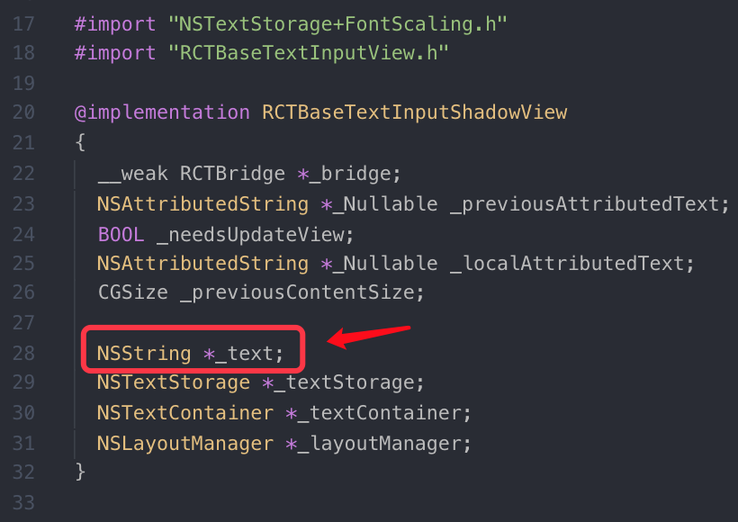
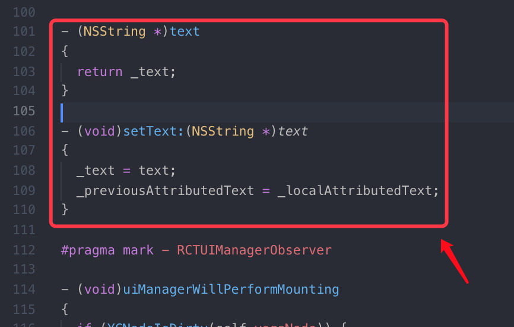
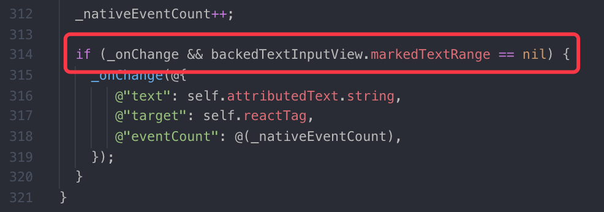
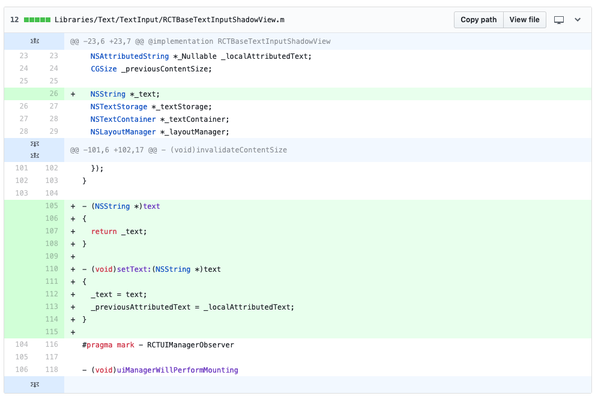
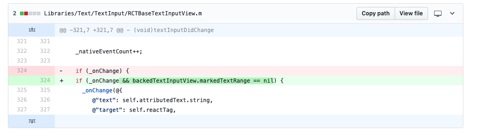

# react-native TextInput 中文输入bug

<Project-Folder>/node_modules/react-native/Libraries/Text/TextInput

- RCTBaseTextInputShadowView.m

- RCTBaseTextInputView.m

[参考](https://github.com/facebook/react-native/pull/18456/files)

