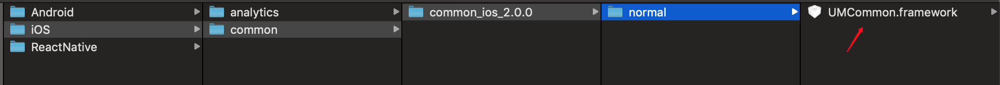
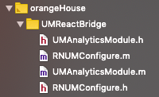

### react native 友盟统计 IOS 端集成

<!-- TOC -->

- [react native 友盟统计 IOS 端集成](#react-native-友盟统计-ios-端集成)
    - [sdk 集成部分](#sdk-集成部分)
    - [ios  和rn 的交互类](#ios--和rn-的交互类)
    - [工程的相关配置 sdk 的初始化](#工程的相关配置-sdk-的初始化)
    - [RN调用部分](#rn调用部分)

<!-- /TOC -->

#### sdk 集成部分

[友盟sdk下载地址](https://developer.umeng.com/sdk/reactnative)

解压后得到这些文件




把这些解压后的framework 导入到工程

 UMAnalytics.framework
 UMCommon.framework

Step 1：Project-->Add Files to 

Step 2：


把上面的包导入，完成集成部分。

#### ios  和rn 的交互类

把官网下载下来解压后的react native 交互代码  拷贝到工程


这四个OC文件



#### 工程的相关配置 sdk 的初始化

在AppDelegate.m 文件中，头文件导入 以及初始化 友盟统计

```objective-c
#import "UMReactBridge/RNUMConfigure.h"  //友盟统计配置文件引入
#import <UMAnalytics/MobClick.h>

/**
   * 友盟统计启动代码 初始化
   */
[UMConfigure setLogEnabled:YES];
[RNUMConfigure initWithAppkey:@"你的appkey" channel:@"App Store"];
[MobClick setScenarioType:E_UM_NORMAL];  //这个和事件埋点相关，要初始化
/***********************************************/
```

OK 原生部分已经完成

#### RN调用部分

这里封装了一下 umtj.js 可作为参考

```javascript
import { NativeModules } from 'react-native';

const UMTJ = NativeModules.UMAnalyticsModule;

export const onPageStart = pageName => {
    //用于统计单个自定义页面的起始和onPageEnd同时使用，不可单独使用
    return UMTJ.onPageStart(pageName);
};
export const onPageEnd = pageName => {
    //用于统计单个Activity页面结束时间
    return UMTJ.onPageEnd(pageName);
};
export const onEvent = eventId => {
    //用于统计自定义事件的发生次数
    return UMTJ.onEvent(eventId);
};
export const onEventWithLable = (eventId, label) => {
    //用于统计自定义事件的发生次数 可传参数进去
    return UMTJ.onEventWithLable(eventId, label);
};
```

调用原生模块

```javascript
import {
    onEvent,
    onEventWithLable,
} from '../utils/umtj';

// 比如这里是个点击事件

click=()=>{
    onEvent('login');
    onEventWithLable('login', '登录成功');
}
```


>注意：如果报 onEventWithLable 这个方法的错误，为了和Android端代码同步，可以把 iOS 中的UMAnalyticsModule.m方法中的 onEventWithLabel 改成 onEventWithLable