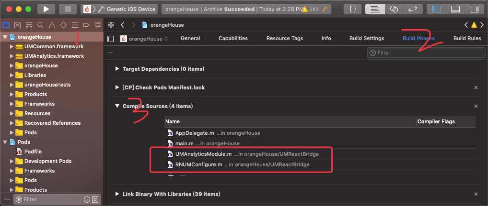

### Xcode 开发中遇到的问题及解决方法


- 'config.h' file not found

  >1. Close **Xcode**.
  >2. `cd <Project-Folder>/node_modules/react-native/third-party/glog-0.3.4`
  >3. Run `./configure`
  >4. Run `make`
  >5. Run `make install`
  >6. Open **Xcode** and try building the Project.

- React Native iOS使用Xcode打开，卡在Running custom shell scripts "install third party"

  一般这种问题基本上可以定位为网络问题。 主要是下面四个文件没下载完成：

  ```
  boost_1_63_0.tar.gz
  folly-2016.09.26.00.tar.gz
  double-conversion-1.1.5.tar.gz
  glog-0.3.4.tar.gz
  ```

  打开[链接](https://github.com/facebook/react-native/blob/master/scripts/ios-install-third-party.sh)，找到最下面的四行：

  ```
  fetch_and_unpack glog-0.3.5.tar.gz https://github.com/google/glog/archive/v0.3.5.tar.gz 61067502c5f9769d111ea1ee3f74e6ddf0a5f9cc "\"$SCRIPTDIR/ios-configure-glog.sh\""
  
  fetch_and_unpack double-conversion-1.1.6.tar.gz https://github.com/google/double-conversion/archive/v1.1.6.tar.gz 1c7d88afde3aaeb97bb652776c627b49e132e8e0
  
  fetch_and_unpack boost_1_63_0.tar.gz https://github.com/react-native-community/boost-for-react-native/releases/download/v1.63.0-0/boost_1_63_0.tar.gz c3f57e1d22a995e608983effbb752b54b6eab741
  
  fetch_and_unpack folly-2018.10.22.00.tar.gz https://github.com/facebook/folly/archive/v2018.10.22.00.tar.gz f70a75bfeb394363d2049a846bba118ffb3b368a
  ```

  下载对应的tar.gz包，然后放到用户目录的.rncache下面，如下： /Users/你的用户名/.rncache

  然后再尝试build，应该就可以启动了。

- 彻底解决_OBJC_CLASS_$_某文件名", referenced from:问题

  >1、.m文件没有导入，在Build Phases里的Compile Sources 中添加报错的文件

  

  > 2、.framework文件没有导入，静态库编译时往往需要一些库的支持，查看你是否有没有导入的库文件
  > 是在Build Phases里的Link Binary With Libraries中添加，同上

  >3、重复编译，可能你之前复制过两个地方，在这里添加过两次，删除时系统没有默认删除编译引用地址
  >在Build Settings里搜索Search Paths  将里面Library Search Paths 中没有用到的地址删除

  >4、最后一个问题，出在静态库生成上面。系统编译生成的静态库有两个，一个真机调用的，一个模拟器调用的。
  >当你在真机测试时导入模拟器静态库，运行就会报错；同样在模拟器测试时调用真机静态库也会报错。
  >
  >解决这一问题也很简单，就是将两个静态库合并，生成一个兼容的静态库。
  >
  >通过Show in finder 找到两个静态库文件，将两个文件复制到一个文件夹里，当然要进行重命名啦，否则就覆盖了。
  >下面打开终端，CD到存放两个文件的文件夹。
  >
  >通过lipo[空格]-create[空格] [真机静态库文件名] [空格] [模拟器静态库文件名] [空格]-output[空格] [合并后的文件名]
  >
  >```bash
  >$ lipo -create zhenji.a moniqi.a -output project.a
  >```

